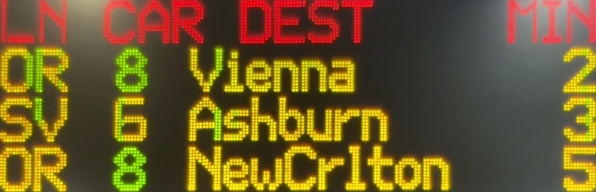
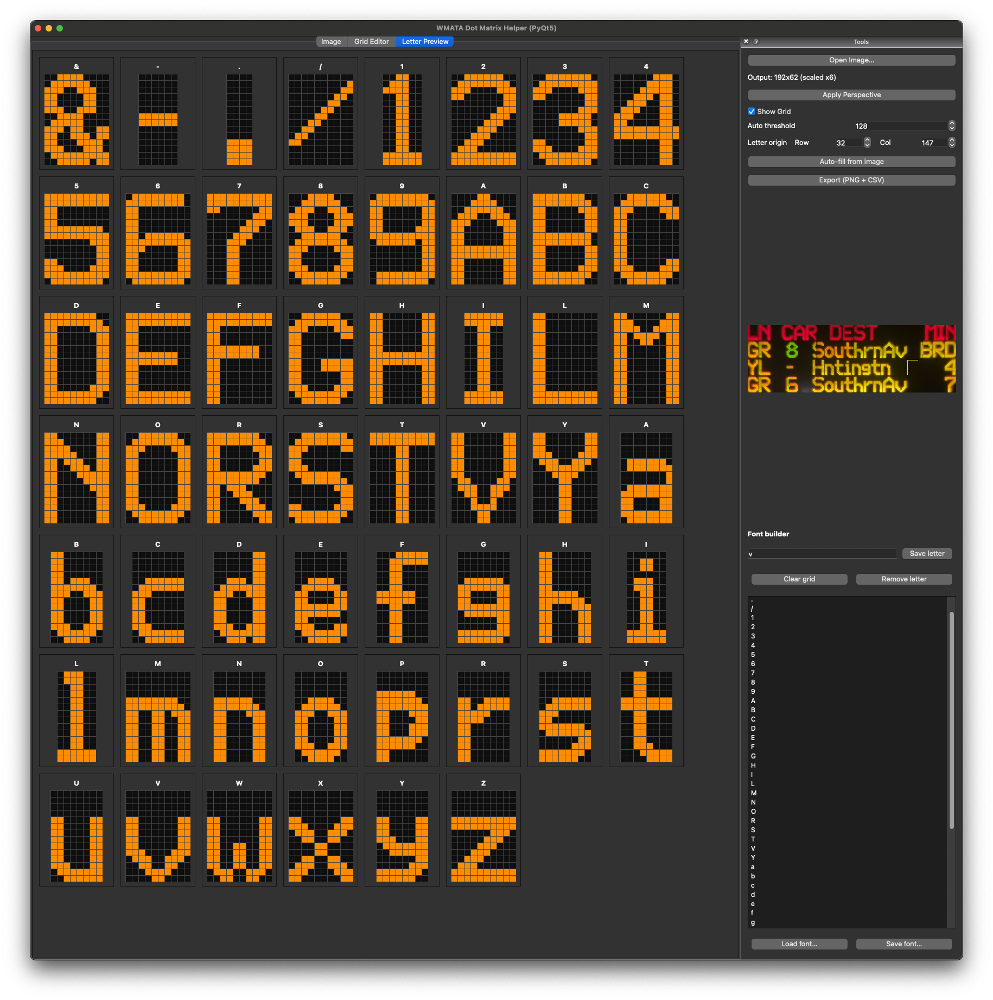

# WMATA Metro Font Builder

This utility allows you to create a dynamic font by sampling letter regions from a photo of a WMATA Metro display. It supports perspective correction and grid overlay for accurate sampling.

This application was created using a Large Language Model (LLM) and is a tool not intended for production systems. Please review the code for accuracy before use.

## Screenshots

Corrected perspective for PIMS showing Silver and Orange Line trains:


Emulated characters using the generated font:


## Installation

Create a virtual environment and install the required dependencies:

```bash
python3 -m venv venv
source venv/bin/activate
pip install -r requirements.txt
```

## Usage

Run the application:

```bash
python src/metro-font-builder.py
```